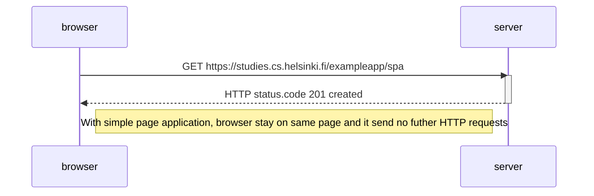

```mermaid
sequenceDiagram
    participant browser
    participant server

    browser->>server: GET https://studies.cs.helsinki.fi/exampleapp/spa
    activate server
    server-->>browser: HTTP status.code 201 created  
    deactivate server

    Note right of browser: With simple page application, browser stay on same page and it send no futher HTTP requests
```
