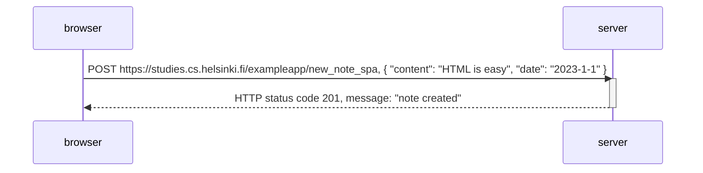

```mermaid

sequenceDiagram
    participant browser
    participant server

    browser->>server: POST https://studies.cs.helsinki.fi/exampleapp/new_note_spa, { "content": "HTML is easy", "date": "2023-1-1" }
    activate server 
    server-->>browser: HTTP status code 201, message: "note created"  
    deactivate server
```
